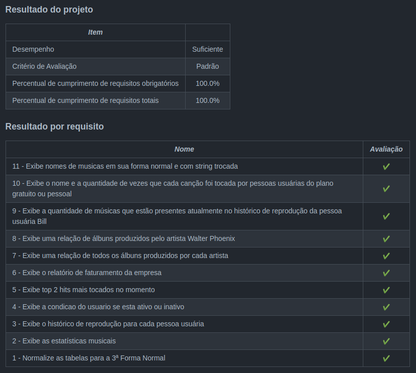

<h1>Sobre</h1>

Terceiro projeto do módulo 3 - Back-end, da <a href="https://betrybe.com" target="_blank">Trybe!</a>

Dessa vez foi o projeto One for all. O desafio foi criar um banco de dados normalizado a partir de informações recebidas de um "cliente", bem como realizar querys com determinados filtros.

<h1>Tecnologias utilizadas</h1>

<ul>
  <li>Docker</li>
  <li>MySQL</li>
</ul>

<h1>Nota</h1>

